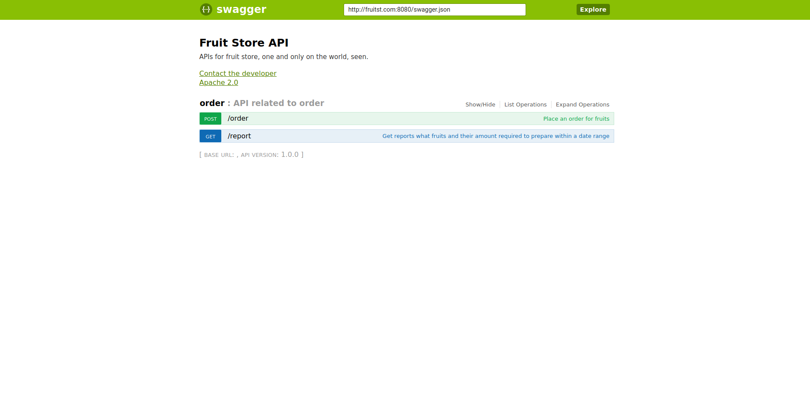

# Simple API for Fruit store

### TL;DR
##### Disclaim: Not test on Windows.

First, clone repository and run application as containers.
```
$ git clone git@github.com:ngockhanhnguyen/fruit_store.git
$ cd fruit_store
# docker-compose up -d 
```
Then, add domain to /etc/hosts because it just a demo:
```
# echo "127.0.0.1 fruitst.com" >> /etc/hosts
```
Finally, open browser and redirect to http://fruitst.com:8080/ui/. Welcome to Fruit store API definition, let's try:


### Usage:
The application support two APIs to processing order as you know. I added timezone offset param on header of both API, on purpose, 
to ensure report result is same when clients at multiple regions with difference timezone.

Try to place an order at 2020/07/15 00:00:00 at timezone +7:
```
$ curl -X POST --header 'Content-Type: application/json' --header 'Accept: application/json' --header 'Timezone-Offset: 7' -d '{ \ 
   "date": 1597424400, \ 
   "fruits": { \ 
     "mango": 5, \ 
     "orange": 6 \ 
   } \ 
 }' 'http://fruitst.com:8080/order'
```

And get back the report, from 2020/07/01 00:00:00 to 2020/07/31 23:59:59 at timezone +7:
```
$ curl -X GET --header 'Accept: application/json' --header 'Timezone-Offset: 7' 'http://fruitst.com:8080/report?from=1596214800&to=1598893199'
```